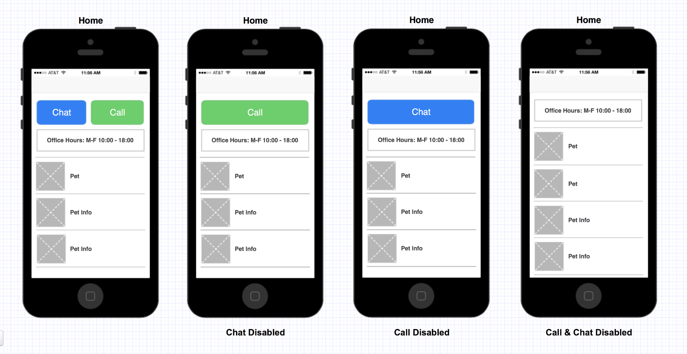

# A small veterinary clinic is in need of an application to allow their users to contact them easily and for them to provide information to their users about their pets

#### Sample API:
- https://jsonkeeper.com/b/PN84 - config

- https://jsonkeeper.com/b/7GTA - pets

### Implement this app with the following requirements:
- Fetch the [config.json](/task/config.json) to check for chat and call feature availability and work hours
- Call and/or chat buttons are at the top (see wireframe):

    

      
    

- Office hours is displayed below the call and chat buttons
- If both the chat and call features are disabled, do not show the corresponding buttons
- Tapping on either buttons should display an alert with the following message
- if within work hours: __"Thank you for getting in touch with us. We'll get back to you as soon as possible"__
if outside work hours: __"Work hours has ended. Please contact us again on the next work day"__
- Fetch the [pets.json](/task/pets.json) for pet information to display on the screen
- Each pet information is presented in a cell with Image and title
- Tapping on a pet info cell would open a new screen that loads the pet information on a webview
- Views should adjust to orientation and screen size accordingly

### DOs:
- Handles the pets list smoothly irrespective of the size.
- Handles HTTP status codes and network failure properly.
- Clean, readable and well-structured code.
- Follow good platform development guidelines wherever applicable.
- Host both json files in a temporary remote server of your choice

### DONTs
- Use standard android sdk libraries only, don't use 3rd-party libraries except for OkHttp
- Okhttp is the __ONLY__ allowed exception
- Retrofit __NOT__ allowed.
- Glide/Picasso __NOT__ allowed.
- Gson __NOT__ allowed.
- __No__ other 3rd party library is allowed

### Bonus:
- Unit / UI tests
- Annotations